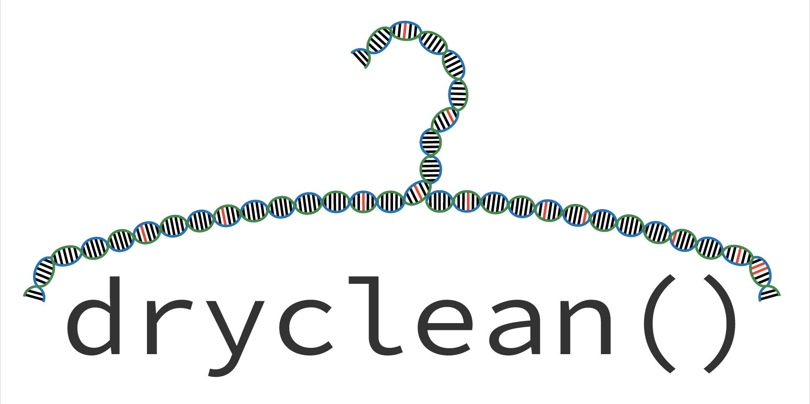

[](https://travis-ci.org/mskilab/dryclean)
[](https://codecov.io/github/mskilab/dryclean?branch=master)

# <font color=black> dryclean </font>




### <font color=black> Robust PCA based method to de-noise genomic coverage data.</font>

## <font color=black> Installations </font>

Install devtools from CRAN


```R
install.packages('devtools')
```

Install dependent packages and latest Bioconductor (if you haven't already)


```R
source('https://bioconductor.org/biocLite.R')
biocLite('GenomicRanges')
```

Install mskilab R dependencies (gUtils)


```R
devtools::install_github('mskilab/gUtils')
```

Install dryclean


```R
devtools::install_github('mskilab/dryclean')
```

## <font color=black> Tutorial </font>

dryclean is a robust principal component analysis (rPCA) based method. dryclean uses a panel of normal (PON) samples to learn the landscape of both biological and technical noise in read depth data. dryclean then uses this landscape significantly reduce noise and artifacts in the signal for tumor samples. The input to the algorithm is GC amd mappability corrected read depth data from fragCounter. Refer to figure below.


###  <font color=black> 1. Creating Panel of Normal aka detergent </font>

For creating PON the following factors are needed:

1. Tumor and normal sample fragCounter outputs should be stored in two different directories
2. A data.table with two columns:
   a. "sample" column contains the sample name you will use to index the sample
   b. "normal_cov" is a column with paths to the normal samples to be used

Following is an example of such a table


```R
normal_table_example = readRDS("~/git/dryclean/inst/extdata/normal_table.rds")
normal_table_example
```


<table>
<thead><tr><th scope=col>sample</th><th scope=col>normal_cov</th></tr></thead>
<tbody>
	<tr><td>samp1                        </td><td>~/git/dryclean/inst/extdata/samp1.rds</td></tr>
	<tr><td>samp2                        </td><td>~/git/dryclean/inst/extdata/samp2.rds</td></tr>
	<tr><td>samp3                        </td><td>~/git/dryclean/inst/extdata/samp3.rds</td></tr>
</tbody>
</table>


There are three ways to make the PON:

1. Using all normal samples availabble. PON can be made with all available normal sample. In this case set use.all = TRUE 


```R
detergent = prepare_detergent(normal.table.path = "~/git/dryclean/inst/extdata/normal_table.rds", path.to.save = "~/git/dryclean/inst/extdata/", mc.cores = 1, use.all = TRUE)
```

2. Using random subset of normal samples availabble. 


```R
detergent = prepare_detergent(normal.table.path = "~/git/dryclean/inst/extdata/normal_table.rds", path.to.save = "~/git/dryclean/inst/extdata/", mc.cores = 1, use.all = FALSE, choose.randomly = TRUE)
```

3. Cluster based approach. In order to keep the size of PON as small as possible but maximize the information in the PON. This is acheived by clustering the genomic background of normal samples and selecting normal samples from each cluster. Hierarchical clustering is used on L matrix after decomposing a small genomic region of all normal samples.


```R
detergent = prepare_detergent(normal.table.path = "~/git/dryclean/inst/extdata/normal_table.rds", path.to.save = "~/git/dryclean/inst/extdata/", mc.cores = 1, use.all = FALSE, choose.by.clustering = TRUE)
```


```R
names(detergent)
head(detergent$L)
```


<ol class=list-inline>
	<li>'L'</li>
	<li>'S'</li>
	<li>'k'</li>
	<li>'U.hat'</li>
	<li>'V.hat'</li>
	<li>'sigma.hat'</li>
</ol>


<table>
<tbody>
	<tr><td>0.1186491</td><td>0.1293625</td><td>0.1181923</td></tr>
	<tr><td>0.3428964</td><td>0.3738583</td><td>0.3415761</td></tr>
	<tr><td>0.1189428</td><td>0.1296828</td><td>0.1184849</td></tr>
	<tr><td>0.1230901</td><td>0.1342045</td><td>0.1226161</td></tr>
	<tr><td>0.1094483</td><td>0.1193309</td><td>0.1090269</td></tr>
	<tr><td>0.1233053</td><td>0.1344392</td><td>0.1228305</td></tr>
</tbody>
</table>


The detergent is a list with the following elements: 
1. L: This is the L low ranked matrix of all the PONs calculated by batch robust PCA mathod
2. S: This is the S sparse matrix of all the PONs calculated by batch robust PCA mathod
3. k: This is estimated rank of a matrix where coverage values from each normal sample forms a column
4. U.hat: svd decompsed left sigular matrix of L required for online implentation of rPCA
5. V.hat: svd decompsed right sigular matrix of L required for online implentation of rPCA
6. sigma.hat: svd decompsed first k sigular values of L required for online implentation of rPCA


###  <font color=black> 2. Identifying germline events </font>

Since a PON is used for decomposing the tumor samples, a method is required identify and remove germline events. This is achieved by looking at all normal samples as a population and infer the markers that have a copynumber events at a given frequency, set by user.

In order to do so, normal samples are treated as tumors and all copy number changes in the normal samples are extracted using thr PON created. Here is an example:

```R
decomp.1 = start_wash_cycle(cov = sample.1, detergent.pon.path = "~/git/dryclean/inst/extdata/", whole_genome = TRUE, chr = NA, germline.filter = FALSE)

```

Once all normal samples are decomposed, the data.table is updated to reflect that:


```R
normal_table_example = readRDS("~/git/dryclean/inst/extdata/normal_table.rds")
normal_table_example
```


<table>
<thead><tr><th scope=col>sample</th><th scope=col>normal_cov</th><th scope=col>decompose_cov</th></tr></thead>
<tbody>
	<tr><td>samp1                        </td><td>~/git/dryclean/inst/extdata/samp1.rds               </td><td>~/git/dryclean/inst/extdata/decomp1.rd</td></tr> 
	<tr><td>samp2                        </td><td>~/git/dryclean/inst/extdata/samp2.rds               </td><td>~/git/dryclean/inst/extdata/decomp2.rd</td></tr>
	<tr><td>samp3                        </td><td>~/git/dryclean/inst/extdata/samp3.rds               </td><td>~/git/dryclean/inst/extdata/decomp3.rd</td></tr>
	
</tbody>
</table>


With this table we can run the following:

```R
grm = identify_germline(normal.table.path = "~/git/dryclean/inst/extdata/normal_table.rds", path.to.save = "~/git/dryclean/inst/extdata/", signal.thresh=0.5, pct.thresh=0.98)

```

Now we are ready for tumor decomposition

###  <font color=black> 3. Running `dryclean` on tumor sample within R</font>

Following is a dummy example. The data diretory has a dummy coverage gRanges object which requires "reads.corrected" field 


```R
coverage_file = readRDS("~/git/dryclean/data/dummy_coverage.rds")
coverage_file
```

```R
GRanges object with 50 ranges and 1 metadata column:
       seqnames    ranges strand | reads.corrected
          <Rle> <IRanges>  <Rle> |           <numeric>
   [1]       22       1-3      * |    1.64885252481326
   [2]       22       3-5      * |    3.81186937098391
   [3]       22       5-7      * |    2.58672125521116
   [4]       22       7-9      * |   0.606155182467774
   [5]       22      9-11      * |    4.83087254804559
   ...      ...       ...    ... .                 ...
  [46]       22     91-93      * |    3.85029493598267
  [47]       22     93-95      * |    2.96715440694243
  [48]       22     95-97      * |    3.56770512764342
  [49]       22     97-99      * |    4.38074178760871
  [50]       22    99-101      * |     0.1496995636262
  -------
  seqinfo: 1 sequence from an unspecified genome; no seqlengths
```

In order to run dryclean, simply invoke the following function


```R
cov_out = start_wash_cycle(cov = coverage_file, detergent.pon..path = "~/git/dryclean/inst/extdata", whole_genome = TRUE, chr = NA, germline.filter = TRUE, germline.file = "~/git/dryclean/inst/extdata/germline.markers.rds")

```


```R
head(cov_out)

```

```R

GRanges object with 6 ranges and 12 metadata columns:
      seqnames  ranges  strand |      background.log      foreground.log
         <Rle> <IRanges> <Rle> |      <numeric>             <numeric>
  [1]        22 1-3          * |     0.169769767795501 -0.0568088592719299
  [2]        22 3-5          * |    0.0177158854407206  0.0770640446340152
  [3]        22 5-7          * |    0.0664955328192282  0.0347592933585855
  [4]        22 7-9          * |     0.230039681056936  -0.100959892306004
  [5]        22 9-11         * | -0.000366098004722278 -0.0812780098385511
  [6]        22 11-13        * |     0.135769072540305  0.0878847580129722
          reads                gc       map   input.read.counts
      <numeric>         <numeric> <numeric>          <numeric>
  [1]       762 0.612756264236902         1   2.78713582604055
  [2]       324 0.587301587301587         1    1.1277123686483
  [3]       474 0.494505494505495         1   1.60676731785653
  [4]      1131 0.568181818181818         1   3.81814927898723
  [5]       254 0.592592592592593         1  0.890949237364552
  [6]       314 0.697819314641745         1   2.43451610256352
             median.chr blacklisted      foreground        background
              <numeric>   <logical>         <numeric>         <numeric>
  [1] 0.608371537098667       FALSE 0.944774637021039  1.18503198738368
  [2] 0.608371537098667       FALSE  1.08011124950716   1.0178737425542
  [3] 0.608371537098667       FALSE  1.03537045825707  1.06875618973741
  [4] 0.608371537098667       FALSE 0.903969288282395  1.25864995349903
  [5] 0.608371537098667       FALSE 0.921937348159965 0.999633969000975
  [6] 0.608371537098667       FALSE  1.09186228639812  1.14541735473137
               log.reads germline.blk
               <numeric>    <logical>
  [1]   1.02501448288477        FALSE
  [2]  0.120191128226724        FALSE
  [3]  0.474224283401017        FALSE
  [4]   1.33976582327867        FALSE
  [5] -0.115467825789155        FALSE
  [6]  0.889748010939351        FALSE
  -------
  seqinfo: 24 sequences from an unspecified genome

```


The output has following metadata fields: 
1. background.log: This is the L low ranked vector after decomposition and represent the background noise separated by dryclean in the log space
2. foreground.log: The S vector with the inferred copy number signal separated by dryclean, that forms foreground, in the log space
3. reads: Raw read counts
4. gc: GC score
5. map: mappability score
6. input.read.counts: This is the fragCounter input in linear space
7. median.chr: median chromosome signal
8. blacklisted: if off target marker list is available and used
9. foreground: Foreground signal, that forms SCNAs (S vector) in read count/ratio space
10. background: This is the L low ranked vector after decomposition and represent the background noise separated by dryclean in read count/ratio space 
11. log.reads: log of the fragCounter signal
12. germline.blk: germline marker based on the inferred germline function


###  <font color=black> 3. Running `dryclean` on tumor sample from command line</font>

```R
./drcln -i inst/extdata/samp1.rds -p inst/extdata/detergent.50.rds 

```

```R
Rprofile Loading
Rprofile Finished Loading


▓█████▄   ██▀███  ██   ██▓ ▄████▄   ██▓    ▓█████ ▄▄▄       ███▄    █
 ██▀ ██▌ ▓██   ██  ██  ██  ██▀ ▀█  ▓██▒    ▓█   ▀ ████▄     ██ ▀█   █
░██   █▌ ▓██ ░▄█    ██ ██  ▓█    ▄  ██░    ░███   ██  ▀█▄   ██  ▀█ ██▒
░▓█▄   ▌ ▒██▀▀█▄   ░ ▐██▓ ▒▓▓▄ ▄██▒ ██░    ░▓█  ▄ ██▄▄▄▄█   ██▒  ▐▌██▒
░▒████▓  ░██▓  ██  ░ ██▒    ▓███▀ ░░█████ ▒█████▒ █     █▒ ██░   ▓██░
 ▒ ▓  ▒  ░  ▓ ░▒▓░  ██    ░ ░▒ ▒  ░░ ▒░▓  ░░░ ▒░ ░▒▒   ▓▒█░░ ▒░   ▒ ▒
 ░ ▒  ▒    ░▒ ░  ░  ░░▒░   ░  ▒   ░ ░ ▒  ░ ░ ░  ░ ▒   ▒▒ ░░ ░░   ░ ▒░
 ░ ░  ░    ░░   ░   ░  ░░  ░          ░ ░  ░    ░    ░   ▒      ░   ░ ░
   ░        ░     ░ ░     ░ ░          ░  ░   ░  ░     ░  ░     ░   ░
 ░               ░ ░     ░       ░    ░     ░     ░      ░     ░ 


(Let's dryclean the genomes!)

Loading PON a.k.a detergent from path provided
Let's begin, this is whole exome/genome
Initializing
Using the detergent provided to start washing
lambdas calculated
Here begins the wash cycle
calculating A and B
calculating v and s
Updating subspace
Combining matrices with gRanges
Giddy Up!

```

All the options and usage is as follows

```R
./drcln -h
```

```R
Rprofile Loading
Rprofile Finished Loading
Usage: ./drcln [options]


Options:
	-i INPUT, --input=INPUT
		Path to cov.rds file, fragCounter output for sample under consideration

	-p PON, --pon=PON
		Path to Panel Of Normal (PON) on which batch rPCA have been run. Within the file should be L, S matrices, estimated rank for burnin samples and svd decomposition matrices for the same

	-m NAME, --name=NAME
		Sample / Individual name

	-b BLACKLIST, --blacklist=BLACKLIST
		blacklisted makers

	-w WHOLEGENOME, --wholeGenome=WHOLEGENOME
		If TRUE then it will process all chromosomes and parallelize it

	-C CHROMOSOME, --chromosome=CHROMOSOME
		If wholeGenome is FALSE, specify the chromosome to process

	-g GERMLINE.FILTER, --germline.filter=GERMLINE.FILTER
		If PON based germline filter is to be used for removing some common germline events, If set to TRUE, give path to germline annotated file

	-f GERMLINE.FILE, --germline.file=GERMLINE.FILE
		Path to file annotated with germline calls, if germline.filter == TRUE

	-c CORES, --cores=CORES
		How many cores to use

	-o OUTDIR, --outdir=OUTDIR
		output directory

	-k COLLAPSE, --collapse=COLLAPSE
		collapse 200bp fragCounter to 1kb

	-h, --help
		Show this help message and exit


```


